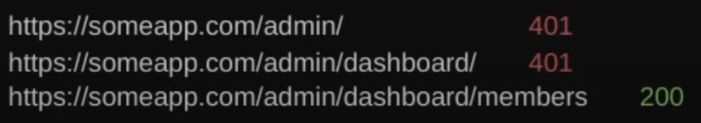
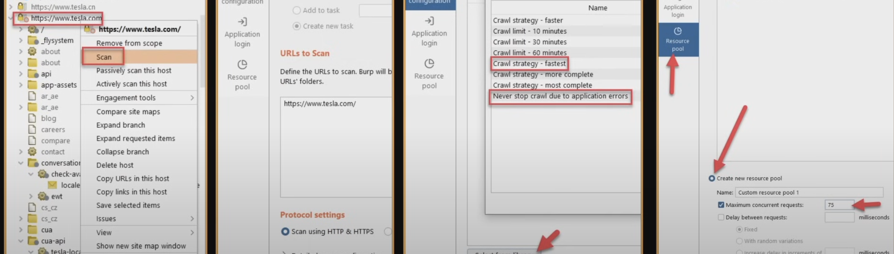

# Enumeration

Sous-domaines:
- https://search.censys.io/
- https://subdomainfinder.c99.nl
- https://pentest-tools.com/information-gathering/find-subdomains-of-domain

Ensuite scan de port sur les sous domaines (rustscan ou nmap)

Extensions firefox (WhatRuns, whatcmsisthis, wappalyzer) + headers de reponse pour trouver les technos

Feroxbuster avec [wordlists](https://wordlists.assetnote.io/) specifiques au techno utilisé, puis [GooFuzz](https://github.com/m3n0sd0n4ld/GooFuzz) et [waymore](https://github.com/xnl-h4ck3r/waymore) pour content discovery.

Regarder aussi la doc de la techno pour trouver les fichiers de config par défault (créer wordlist pour fichiers de config de cette techno pour la prochaine fois)

Si application android, [apkleaks](https://github.com/dwisiswant0/apkleaks) pour trouver d'autres endpoints

Si réponses 401 (Unauthorized), essayer waybackmachine + recursion dans le dossier:

Spidering avec burp et/ou [gospider](https://github.com/jaeles-project/gospider)

# Application analysis

Choses à trouver:
- Comment l'app gère l'envoie de données (Api REST, graphql, resource param value...)
- Comment l'app parle de l'utilisateur (id, uuid, email...) pour idor etc
- Existe-t-il plusieurs types de compte
- Vulns dans le passé (Plus facile sur hackerone)
- Comment les technos utilisés gèrent les differentes types de vulns
- Comment gerent-ils les `<`, `>`, `"`, `'`, peut-on bypass des checks avec `%09`, `%07`, `%0d%0a`

## Fonctionnalités

### Register
- Données reflected où dans l'app?
- Chars bloqués?
- Peut on créer de compte avec un email de la boite?
- Peut on revisiter la page de register une fois login pour controler la redirect?

### Login/Password Reset
- `myemail%00@email.com` == `myemail@email.com` : account takeover
- Idor pour changer le mdp d'autres users
- Si pas de confirmation/csrf pour changer mdr : account takeover

### Dev tools = gold mine

### Features à venir
- Twitter/autres
- Newsletter
- Affiliate programs

## Types de vulns

### XSS
- Toujours essayer [blind xss](https://github.com/mandatoryprogrammer/xsshunter-express), on sait jamais!
- Essayer tous les [parametres reflechis](https://portswigger.net/bappstore/8e8f6bb313db46ba9e0a7539d3726651) 
- Essayer double url encode ...

### CSRF
- Commencer par regarder les endroits qui devraient etre protégés: changement mdp, delete account, changement d'infos sur le compte
- Deja, est-ce qu'ils ont un token csrf?!
- Si oui, essayer d'autres valeurs (string random, vide, token tres tres long), le but etant de provoquer des erreurs
- Referer localhost peut-il bypass csrf?

### SSRF
- Features qui manipulent des urls

### IDOR
- Plus de idors en general sur mobile
- Si endpoint prend un uuid, essayer un int ou des valeurs par exemple 0, 0000000 ....

### SQLI
- Essayer de trouver des features les plus anciennes
- Toujours utiliser des payloads sleep pour trouver les blind aussi 

# Extensions / Autres outils
## Extensions burp
- Backslash powered scanner
- retire.js
- collaborator everywhere
- active scan ++
- js miner
- Reflected Parameters

## Extensions firefox
- foxyproxy
- dotgit
- shodan
- user agent switcher 

https://waf-bypass.com/

# OOPS
https://github.com/h3110w0r1d-y/BurpLoaderKeygen
https://github.com/Leon406/BurpSuiteCN-Release

